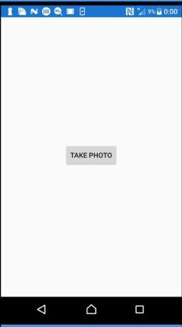
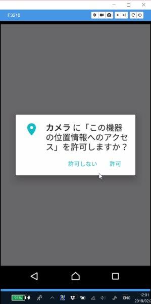

# XFCameraMediaPluguinSample
- [MediaPlugin](https://github.com/jamesmontemagno/MediaPlugin)のサンプルです。
- Xamarin.FormsのAndroid版のみ動作します。
### 手順（Android）
1. Xam.Plugin.Mediaをnugetからインストール
1. MainPage.XAMLにButtonとImageを配置
1. Button.Clilkedイベントにカメラ起動から保存までを実装
1. AndroidManifest.xmlに以下を追加
    - カメラ使用のPermission（WRITE_EXTERNAL_STORAGE）
    - 画像を保存するためのFileProvider（android.support.v4.content.FileProvider）
1. Resources/xml/file_path.xmlを追加
### スクショ

