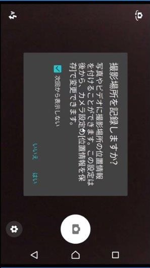

# XFCameraMediaPluginSample
### 説明
- Xamarin.Formsによるカメラ撮影とGPS情報のサンプルです（Android版のみ）。
- Prismを使用しています。
- カメラ撮影は [MediaPlugin](https://github.com/jamesmontemagno/MediaPlugin) を使用しています。
- GPS情報は [Geolocator Plugin](https://github.com/jamesmontemagno/Xamarin.Plugins/tree/master/Geolocator) を使用しています。
### 実装手順（抜粋、Androidのみ）
1. （事前準備）拡張機能と更新プログラムから Prism Template Pack をインストール
1. プロジェクトの新規作成で Prism → Xamarin.Forms → Prism Blank App(Xamarin.Forms) を選択
1. NuGetからXam.Plugin.Media（MediaPlugin）とXam.Plugin.Geolocator（Geolocator Plugin）をインストール
1. MainPageViewModel.csの実装
    - カメラの起動から保存までを実装（TakePhotoCommand）（参考: MediaPlugin の[サンプル](https://github.com/jamesmontemagno/MediaPlugin/tree/master/samples)）
    - （画像保存時に）GPS情報を取得（参考: [Plugins for Xamarinを使いこなすには？（GPS編）](https://www.buildinsider.net/mobile/xamarintips/0063)）
    - 各種プロパティ、コマンドを追加
1. MainPage.XAMLの実装
    - Button,Imageを配置
    - ActiveIndicator（処理中にくるくる回るやつ）を中央に配置（参考: [インジケータを画面中央に表示する方法](http://itblogdsi.blog.fc2.com/blog-entry-193.html) ）
    - ButtonのCommandにTakePhotoCommandをBindingします。
1. AndroidManifest.xmlに以下を追加
    - カメラ使用のPermission（WRITE_EXTERNAL_STORAGE）
    - GPS情報取得のPermission（ACCESS_COARSE_LOCATION, ACCESS_FINE_LOCATION）
    - 画像を保存するためのFileProvider（android.support.v4.content.FileProvider）
1. Resources/xml/file_path.xmlを追加
### スクショ

