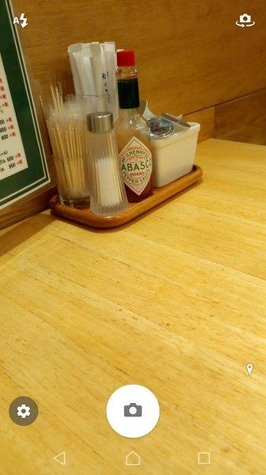
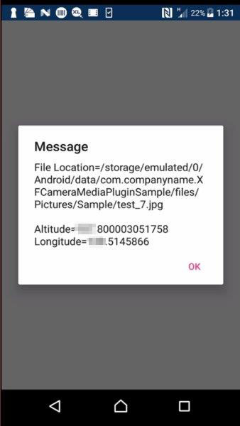
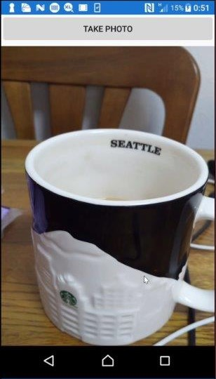

# XFCameraMediaPluginSample
### 説明
- カメラで画像を保存してGPS情報を取得します。
- カメラ撮影は[MediaPlugin](https://github.com/jamesmontemagno/MediaPlugin)を使用しています。
- GPS情報は[Geolocator Plugin](https://github.com/jamesmontemagno/Xamarin.Plugins/tree/master/Geolocator)を使用しています。
- Xamarin.FormsのAndroid版のみ動作します。
### 実装手順（Androidのみ）
1. NuGetからXam.Plugin.Media（MediaPlugin）とXam.Plugin.Geolocator（Geolocator Plugin）をインストール
1. MainPage.XAMLにButtonとImageを配置
1. Button.Clilkedイベントに以下を実装
    - カメラ起動から画像の保存（参考: MediaPluginの[サンプル](https://github.com/jamesmontemagno/MediaPlugin/tree/master/samples)）
    - （画像保存時に）GPS情報を取得（参考: [Plugins for Xamarinを使いこなすには？（GPS編）](https://www.buildinsider.net/mobile/xamarintips/0063)）
1. AndroidManifest.xmlに以下を追加
    - カメラ使用のPermission（WRITE_EXTERNAL_STORAGE）
    - 画像を保存するためのFileProvider（android.support.v4.content.FileProvider）
1. Resources/xml/file_path.xmlを追加
### スクショ

